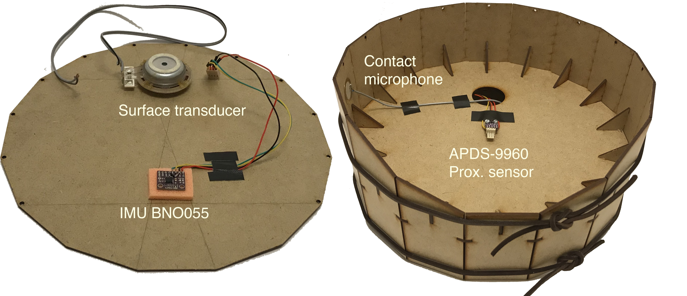

# The Daïs: A Haptically Enabled Electronical Instrument

The daïs is an open source *new interface for musical expression* (NIME) developed as a research project at the Sound and Music Computing (SMC) masters programme at Aalborg University Copenhagen.

The daïs main feature is a disk that is suspended using elastic string.
The instrument is played by pushing down and moving the disk around.
The position and angle of the disk is captured by sensors and can be used to control sound synthesis algorithms or effect.

Multiple parameters to be controlled with a single movement, and the gestures afforded by the instrument produce a performative playing style.
The disk is haptically enabled using vibrotactile transducers that facilitate an intimate playing experience.

This repository is still a work in progress but hopefully it will grow to contain coherent instructions on how to build and use the Daïs.

## About this Repository

This repository contains everything you need to build your own daïs.

The *source* folder contains a ready-to-use Bela application that will read the sensors and produce a synthesized bowed string sound.

*dais_mechanical_design.scad* is an OpenSCAD file of the mechanical design of the daïs that can be used to generate files for laser cutting.

## Building a daïs

To build a daïs you will need the following tools and software

* [OpenSCAD](https://www.openscad.org/downloads.html).
* A vector drawing program such as Adobe Illustrator, CorelDraw or [Inkscape](https://inkscape.org/) (free).
* A laser cutter.
* A soldering iron.
* Misc. small tools such as scissors, cutter, and pliers.

The electronics parts you need are

* A [Bela](https://bela.io/).
* An APDS9900 breakout board (e.g. the one from [Sparkfun](https://www.sparkfun.com/products/12787)).
* A Bosch Sensortec BNO055 breakout board (e.g. [this one on ebay](https://www.ebay.com/itm/BNO055-MCU-9DOF-Intelligent-9Axis-Attitude-Sensor-Angle-gyroscope-Accelerometer/323248036779?hash=item4b43159bab:g:lzUAAOSwFUxa8rDp)).
* A small stereo amplifier board ([such as this one](https://www.banggood.com/TPA3118-2x30W-8-26V-DC-Stereo-Bluetooth-Digital-Amplifier-Board-p-1095250.html?rmmds=search&cur_warehouse=CN)).
* A surface transducer ([like this one](https://www.sparkfun.com/products/10975)).
* Some wire and optionally some Bela-compatible Molex connectors.

Other matrials needed are

* Solder.
* SuperGlue.
* Strips.
* Elastic string, 1m, around 3mm in diameter.
* Leather straps or string, around 2m.
* Duct tape (don't know for what exactly but you will probably need it).

The parts and materials should be assembled like so:

## Whish list

This repository is far from perfect, these are the things needed to make it good:

* Add desciption on how to get the source code onto the bela (use the *push* script in the *source* folder)
* Add descriptions of the parameter mapping of the software.
* Add the paper (when its done).
* Through build instruct with step-by-step pictures.
* Clean up code and add comments.
* Make a video of the build process and the instrument being played.